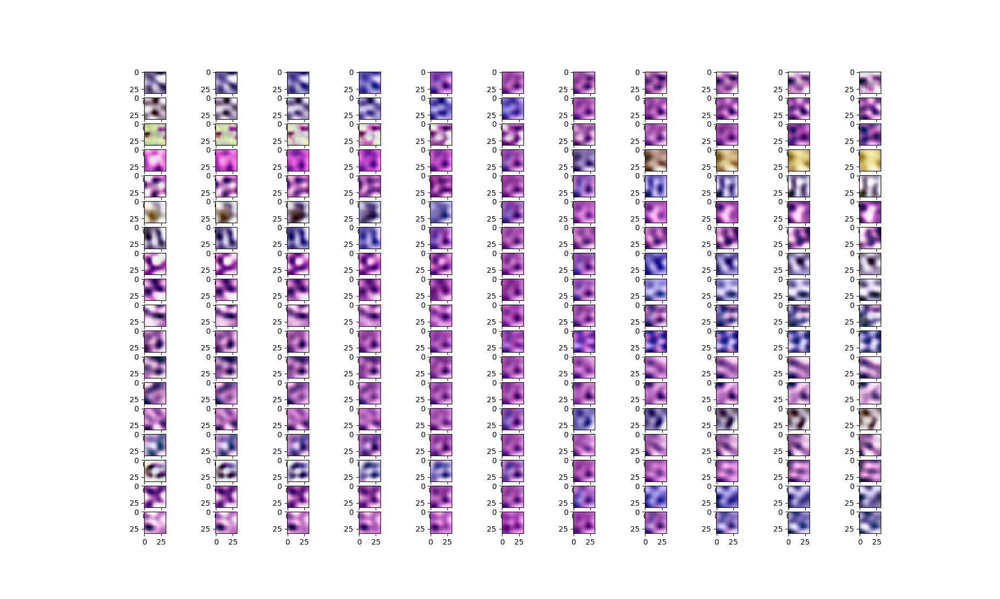

# dpath_gae



## Disclaimer
Development of this project started as Master's Thesis at Technical University of Munich and is now continued as part of my work at Masaryk University in Brno, Czech Republic.
Main contributors are also [Vlad Popovici](https://www.muni.cz/en/people/118944-vlad-popovici) and [Hasan Sarhan](http://campar.in.tum.de/Main/HasanSarhan).
It is targeted towards disentangled representation learning for digital pathology data as a custom similarity metric for deformable image registration.

Please note that this project is under development and doesn't contain the main content as of today.
Collaborations and contributions are welcome!
## Setup
### Python

Packages to install via pip3:
*  [tensorflow](https://www.tensorflow.org/install/pip) v1.12, preferably with [GPU suppurt enabled](https://www.tensorflow.org/install/gpu). GPU support is not necessary, but makes stuff faster.
*   numpy
*   scipy
*   matplotlib
*   [gitpython](https://gitpython.readthedocs.io/en/stable/intro.html#installing-gitpython) & [gitdb](https://pypi.org/project/gitdb/)
*   re

### C++

None of the C++ functionality is implemented as of now, so these are future dependencies.

*  Install [CUDA](https://developer.nvidia.com/cuda-zone) if you have a NVIDIA GPU.
*  Install [ITK](https://github.com/InsightSoftwareConsortium/ITK).
    *  Clone from github and check out v4.13.1
    *  Configure and build it using CMake
    *  Install it using [checkinstall](https://debian-administration.org/article/147/Installing_packages_from_source_code_with_checkinstall), you might want to remove it later.
*  Install [tensorflowCC](https://github.com/FloopCZ/tensorflow_cc).
*  Install Qt5 v5.9.5

## Usage: JSON Configuration Files

Models are defined using json configuration files which are passed to the program which creates the respective tf.estimator model and the operations required for training etc.

### Datasets

Dataset preparation can be implemented oneself by implementing the function passed to tf.Estimator.train(...).

```python
def train_fn(args):
    # Load and preprocess dataset.
    # dataset = tf.data.TFRecordDataset(...)
    # dataset = dataset.map(...)
    return dataset

def main(argv):
    # ...
    classifier.train(input_fn=train_fn, steps=steps)
    # ...
```

Another option is to specify the dataset in the JSON configuration file, this is illustrated in an [example](examples/dataset).

```json
{ 
    "datasets": {
        "training": {
            "filename": "examples/dataset/training_ds.tfrecords",
            "size": 100000,
            "operations": [ "..." ]
        },
        "validation": { "..." },
        "test": { "..." },
        "batch":200,
        "features":[ "..." ]
    }
}
```

Fields describing individual datasets which can be populated are *training*, *validation* and *test*.
Currently, only *training* is supported.

Each dataset contains the *filename*, the number of samples to extract from this dataset as *size*, the number of *steps* to run on this dataset and an optional array of *operations* to run in the preprocessing.

Entries valid for all datasets are the *batch* size to use and the *features* of the dataset on disk, a list of triples containing of *key*, *shape* and *dtype*, similar to the features defined as model inputs.
Note that the label has to be defined as a feature with the *key* "label".

### Model
The model is specified by its *inputs* and *components*.

```json
{
    "model": {
        "inputs": { "..." },           
        "components":[ "..." ]
    }
}
```
#### Inputs
The *inputs* are supposed to have the following structure:

```json
{
    "inputs": {
        "features":[
            {
                "shape": [1],
                "key": "val",
                "dtype": "tf.float32"
            }
        ],
        "labels": {
            "shape": [1],
            "dtype": "tf.float32"
        }
    }
}
```

The input *features* to the model are an array, each element being composed of *shape*, *key* and *dtype* information. The second field is the labels, which only support a single entry now defined by *shape* and *dtype*.

#### Components
The second part of the model are its *components*.

```json
{
    "components":[
        {
            "name":"network",
            "input": "val",
            "layers": [ "..." ],
            "output":"logits"
        }
    ]
}
```

A *component* is defined by its *name*, *input*, the *layers* and its *output*.

The *input* of a component is the *key* of a feature describes in the model *inputs* or the name defined by the *output* field of a preceding component. The *output* field therefore defines the key under which the output values of this component can be accessed.
*Layers* is an array, each entry defining a layer in the model. The layers are connected in the ordering in which they are defined in the array.

Which fields are used to define properties regarding layers is described in [Layer.py](../packages/Tensorflow/Model/Layer.py).
A detailed list of which layers can be specified and how is available [here](../packages/Tensorflow/Model)

For examples of how to specify possible configurations and the corresponding python code to create the models are given in [Examples/Models](examples/models).


## Examples

The [examples](examples) folder contains functionality which illustrates how to use this project.