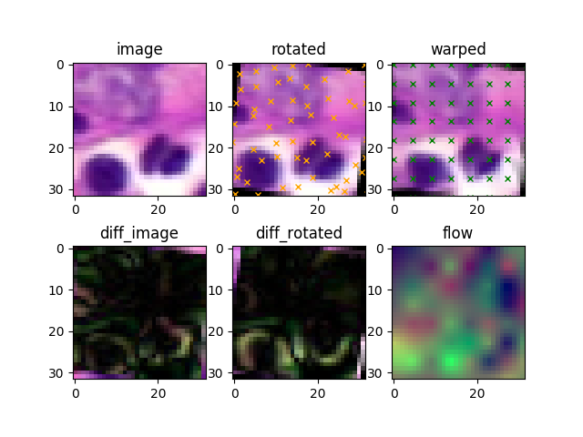

# Examples

## Dataset

The dataset folder contains the following examples:
*   [How to create a Dataset?](dataset/create_dataset.py): Script shows how to use the functionality provided by the [Dataset](../packages/Tensorflow/Dataset) package to write a dataset from numpy data. Note that to run the [gae_model](models/gae/gae_model.py), a dataset created using the [tools](../tools/dataset) scripts is required.
*   [How to Create a Model using a Dataset?](dataset/model_with_dataset.py): Example of simple model loading a dataset from memory using the configuration system and using a custom operation in the dataset preprocessing, specified in [operations.py](dataset/operations.py).

## Models

### GAE
The main model system which is described [here](gae). An overview is also given in the main [ReadMe](..).

### Autoencoder

### Simple Model

The simple model example illustrates how to create a model with a single *component* and how to write the code for the model.

## Registration

The registration examples require a trained model since they use the latent space representation of image patches as similarity measurement for optimization of transformation parameters.

Both methods - symmetric and non-symmetric - rely on the [tf.contrib.image.sparse_image_warp](https://www.tensorflow.org/versions/r1.12/api_docs/python/tf/contrib/image/sparse_image_warp) function which takes an image as well as two sets of control points, outputting a deformation field and the warped image.

The registration procedure follows these steps:
1.  Extract (overlapping) patches with fixed size and stride from fixed and moving image (or both, in symmetric version).
2.  Run inference on all patches to get latent representations as distributions over latent space.
3.  Compute loss as distance between distributions of patches at same spatial positions.
4.  Minimize image distance by optimizing the transformation parameters - the control point positions - and repeat.

Intermediate results are displayed using pyplot. The x shaped marks indicate the positions of the control points where the input image is sampled.

### Symmetric

The symmetric registration optimizes two sets of control points, one over each image and warps both images to a common set of fixed, regular target points.

The benefit of this approach is that it doesn't assume correctness of a single image and is *theoretically* scalable to any number of images to be registered. Practically, it gives the algorithm more freedom in choosing parameters but tends to find suboptimal solutions by introducing strong deformations on both images which yield a good fit of the warped images.

### Non-symmetric

The non-symmetric warping considers one image as fixed target image and the positions of the control points over the moving image are optimized to reduce the distance to the fixed image.

Figure shows non-symmetric warping in order to register a rotated version of an image patch to itself.